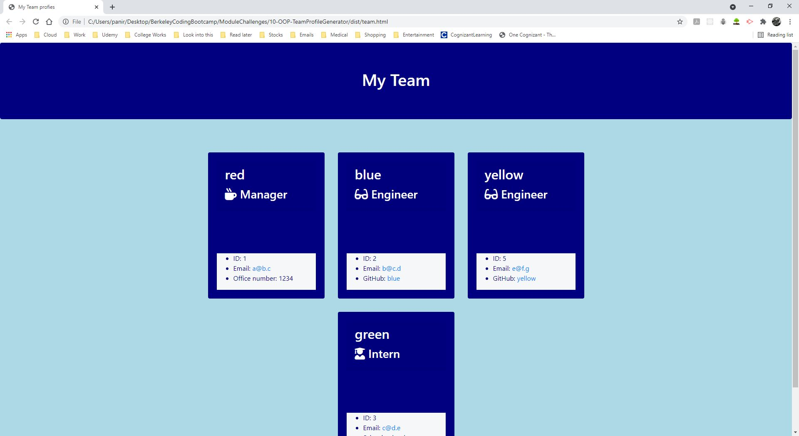

# 10 Object-Oriented Programming: Team Profile Generator
## Screenshot demo
Here are 3 screenshot gifs to show you both the project working, the result and the project tests working

### Screenshot 1 (Project running)


### Screenshot 2 (Project results)



### Screenshot 3 (Project jist tests)


## Report
This week we are working with object oriented programming to build this application. I started off buy reviewing what this project required and broke it down into smaller more manageable problems or sections. Throughout this document I will explain why I did what I did and what I used to get to the end result I got

### Pre steps
I started off buy reading the instructions to break down the user story into deliverable issues. while doing so I saw that there was a recommended file system I could follow, so I set up my project using that. Along with that I made sure to make every single file I would need and commit all of that to my repository. The next thing I did was decide how I would break up the issues/sections of this project. I ended up deciding to break up the project into the following.
1. class design
2. class test design
3. Driver/index 
4. generateHTML
So Using this I set to work.

### Step 1
From my research and practice in class I learned about how to set up classes. And from the instructions I was able to acertain that I needed to create an employee parent class and 3 different child classes of employee which are manager, engineer, and intern. Here is an example of the parent class

```
class Employee {
    //Constructor
    constructor(eName, eEmail, eID) { 
        this.name = eName; 
        this.email = eEmail; 
        this.id = eID; 
    }
    //Getter functions
    getEName(){
        return this.name;
    }
    getEEmail(){
        return this.email;
    }
    getEID(){
        return this.id;
    }

    getEType(){
        return "Employee";
    }
}
```

and here is an example of the child class structure

```
class Manager extends Employee {
    //constructor
    constructor(eName, eEmail, eID, oNum){
        super(eName, eEmail, eID); 
        this.office = oNum; 
    }
    //Getter functions
    getOnumber(){
        return this.office;
    }

    getEType(){
        return "Manager"
    }
}
```
by following this design we have a standard class that is meant to be a blueprint for employee objects. by extending that blueprint to the child classes they also have access to the data provided to the employee object. They are basically derivitaves of employee. After building all of the classes I considered step/issue 1 finished.

### Step 2
This is something I had to double check to make sure because I didnt understand the instructions clearly, but once I resolved my confusion I was able to confirm that I needed to write jist tests. After npm installing jest I started 4 different test files like the instructions showed. each test file is for each class file I made. Here is an example of one of the tests I wrote.

```
test("Instanciating a whole employee and testing its entire functionality", () =>{
    const tName = "Mario";
    const tEmail = "jumpman310@nintendo.com";
    const tID = 1;
    const tType = "Employee";
    const employee = new Employee(tName, tEmail, tID);

    expect(typeof(employee)).toBe("object");
    expect(employee.name).toBe(tName);
    expect(employee.email).toBe(tEmail);
    expect(employee.id).toBe(tID);

    expect(employee.getEName()).toBe(tName);
    expect(employee.getEEmail()).toBe(tEmail);
    expect(employee.getEID()).toBe(tID);
    expect(employee.getEType()).toBe(tType);
});
```
This test tested everything about the employee.js class file, but while this was a good example my tutor explained to me that this doesnt really test or show anything aside from the whole object being created. Instead he advised me to break it down a bit more, so as per his instructions and examples I have seen I did this

```
test("Create Employee Class instance", () => {
    const employee = new Employee();
    expect(typeof(employee)).toBe("object");
});
```
individual tests that test one thing each, that way I can see what succeeds and what fails. I did this for the rest of the tests for all of my class files. After testing them I was able to iron out any errors and clean up my code until the test cases were satisfied.

### Step 3
This is the potato's of the project, while the classes and tests are object oriented programming which is the meat of the project. Both are significant its just we have done this type of stuff before in the nodeJS module and activities. Here what I did was I imported all of the classes I defined from their js files, I installed and imported/required inquirer, I required fs, and push.
After that Like in my previous challenge I created a questions array. This time however I decided to create multiple. questions arrays with different question objects. Each for the type of employee they are meant for. after that I use their corresponding functions that I made (assignManager, addEngineer, addIntern) to create a inquirer prompt using their corresponding array of questions to collect the correct information. For add engineer and add intern however I used a function called build team that allows for the user to follow a inquirer prompt that lets them choose which they want to add, if they choose engineer the addengineer function is called, if they choose intern the addintern function is called, otherwise generateProfile is called. generateProfile is a function that will either create the output directory dist if it is not created or it will create or replace the test.html in there using generateHTML.js to create the html file.

### Step 4
This is where the experience from the node challenge last week comes in we kind of do the same thing that we did in that, except here we are generating an html dynamically. Thinking about it there are a couple of things that we need to make sure are dynamic, the manager cards being created and the engineer and the intern cards that are created as well. So what I did is create 3 seperate functions that will generate the html specific to each type of employee. Here is an example

```

```

I then used this logic in order to both generate html based on what is in the team array that is passed into this function and join all of the html together dynamically based on filtering out employees based on the type of employee and their role. I use map to create a new array based on the result of the filter and pass that array through to the render_() function ( _= employee type ). Here is the logic I wrote

```
const html = [];
    html.push(team
        .filter(employee => employee.getEType() === "Manager")
        .map(manager => renderManager(manager))
    );
    html.push(team
        .filter(employee => employee.getEType() === "Engineer")
        .map(engineer => renderEngineer(engineer))
        .join("")// join is used to join the html together
    );
    html.push(team
        .filter(employee => employee.getEType() === "Intern")
        .map(intern => renderIntern(intern))
        .join("")
    );
    return html.join("");
```
I learned how to do this thanks to a tutoring session. I was stuck trying to figure out how best to distinguish the different types of employees in the team array and how to use that information to make dynamic HTML files, I was then explained to look up .filter and .map and given this snippet with an explanation as to why this works. The description I gave above is my condensed understanding of that. After this it I created a function that renders and generates the boilerplate html code and also takes the html that is created in render team and joins it to the boilerplate. This is done with this, which basically calls the renderTeam function.

```
${renderTeam(team)}
```
After that I tested the project to see if it ran correctly and after ironing out a few errors I was able to succeed in getting a deliverable

### Struggles
I had a time constraint this week too, but thanks to some tutoring I was able to get help with some of the more menial and time consuming stuff that I could get answers to then and there. Like I asked my tutor what is the best way to generate CSS and what should I try to do to avoid overcomplication. I wanted to focus on the meat of this assignment which is object oriented programming. Thanks to talking to him I got an understanding of how the CSS and the generated HTML should look and was able to use that to build my project a bit more easily. I also missed a class in this week and that made it even more difficult to get things going, Thanks to my tutor session I was able to fill gaps that I missed like extending classes and class structure as well as jest testing. That helped alot too. I was able to utilize my tutor resource to help me better understand how to set up and deliver on this project as best as I can.

## Instructions
Your challenge is to build a Node.js command-line application that takes in information about employees on a software engineering team and generates an HTML webpage that displays summaries for each person. Because testing is key to making code maintainable, you’ll also write unit tests for each part of your code and ensure that it passes all of them.

Because this application won’t be deployed, you’ll also need to provide a link to a walkthrough video that demonstrates its functionality and all of the tests passing. You’ll need to submit a link to the video **and** add it to the README of your project.

**Note**: There is no starter code for this assignment.

## User Story

```md
AS A manager
I WANT to generate a webpage that displays my team's basic info
SO THAT I have quick access to their emails and GitHub profiles
```

## Acceptance Criteria

```md
GIVEN a command-line application that accepts user input
WHEN I am prompted for my team members and their information
THEN an HTML file is generated that displays a nicely formatted team roster based on user input
WHEN I click on an email address in the HTML
THEN my default email program opens and populates the TO field of the email with the address
WHEN I click on the GitHub username
THEN that GitHub profile opens in a new tab
WHEN I start the application
THEN I am prompted to enter the team manager’s name, employee ID, email address, and office number
WHEN I enter the team manager’s name, employee ID, email address, and office number
THEN I am presented with a menu with the option to add an engineer or an intern or to finish building my team
WHEN I select the engineer option
THEN I am prompted to enter the engineer’s name, ID, email, and GitHub username, and I am taken back to the menu
WHEN I select the intern option
THEN I am prompted to enter the intern’s name, ID, email, and school, and I am taken back to the menu
WHEN I decide to finish building my team
THEN I exit the application, and the HTML is generated
```

## Mock-Up

The following image shows the generated HTML’s appearance and functionality. The styling in the image is just an example, so feel free to add your own styles:


## Getting Started

This Challenge will combine many of the skills you’ve learned over the first ten weeks of this course. To help you get started, we’ve provided some guidelines in addition to the User Story and Acceptance Criteria.

Your application should use [Jest](https://www.npmjs.com/package/jest) for running the unit tests and [Inquirer](https://www.npmjs.com/package/inquirer) for collecting input from the user. The application will be invoked by using the following command:

```bash
node index.js
```

It is recommended that you start with a directory structure that looks like this:

```md
__tests__/			// jest tests
  Employee.test.js
  Engineer.test.js
  Intern.test.js
  Manager.test.js
dist/               			// rendered output (HTML) and CSS style sheet
lib/				// classes
src/				// template helper code
index.js			// runs the application
```

The application must have these classes: `Employee`, `Manager`, `Engineer`, and `Intern`. The tests for these classes (in the `_tests_` directory) **must all pass**.

The first class is an Employee parent class with the following properties and methods:

* `name`

* `id`

* `email`

* `getName()`

* `getId()`

* `getEmail()`

* `getRole()`   // Returns 'Employee'

The other three classes will extend `Employee`.

In addition to `Employee`'s properties and methods, `Manager` will also have:

* `officeNumber`

* `getRole()`   // Overridden to return 'Manager'

In addition to `Employee`'s properties and methods, `Engineer` will also have:

* `github`  // GitHub username

* `getGithub()`

* `getRole()`   // Overridden to return 'Engineer'

In addition to `Employee`'s properties and methods, `Intern` will also have:

* `school`

* `getSchool()`

* `getRole()`   // Overridden to return 'Intern'

Finally, although it’s not a requirement, you should consider adding validation to ensure that user input provided is in the proper expected format.


## Review

You are required to submit the following for review:

* A walkthrough video demonstrating the functionality of the application and passing tests.

* A sample HTML file generated using your application.

* The URL of the GitHub repository. Give the repository a unique name and include a README describing the project.

- - -
© 2021 Trilogy Education Services, LLC, a 2U, Inc. brand. Confidential and Proprietary. All Rights Reserved.
